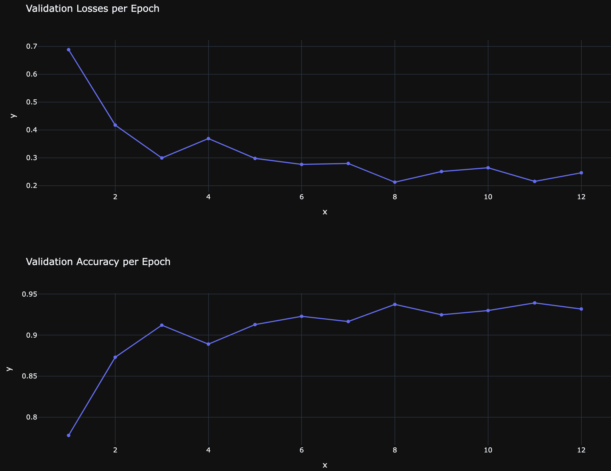
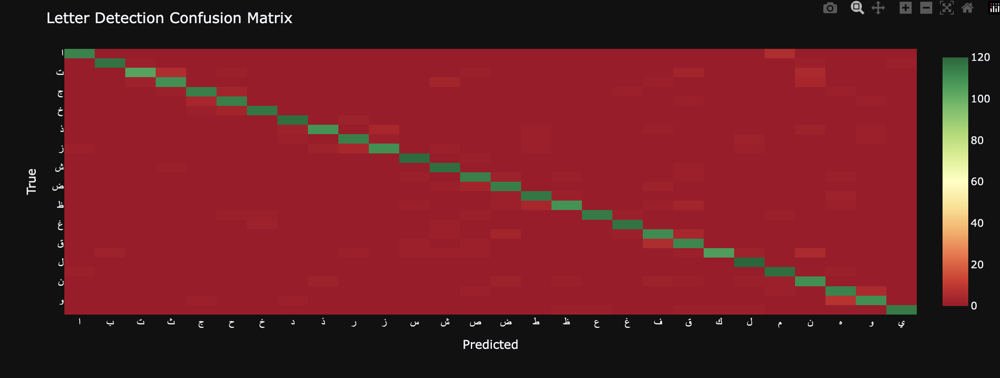

# Arabic Character Recognition

Arabic is usually written calligraphically, which makes a full handwriting task much harder. But when letters are
separated into their isolated forms, the task becomes much easier. This is a dataset similar in spirit to MNIST. The
data has been made available by the authors of the
paper (https://www.wseas.org/multimedia/journals/computerresearch/2017/a045818-075.pdf).

A convolutional neural network is used to train this recognizer, and achieves an accuracy close to the paper's result.

