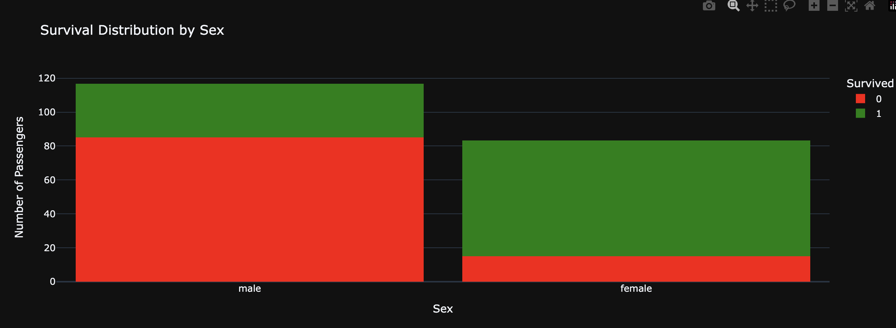
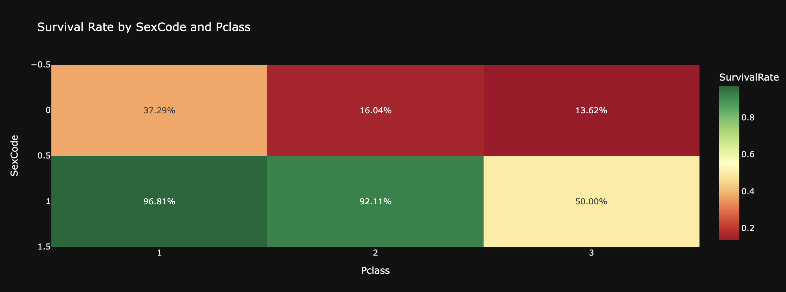
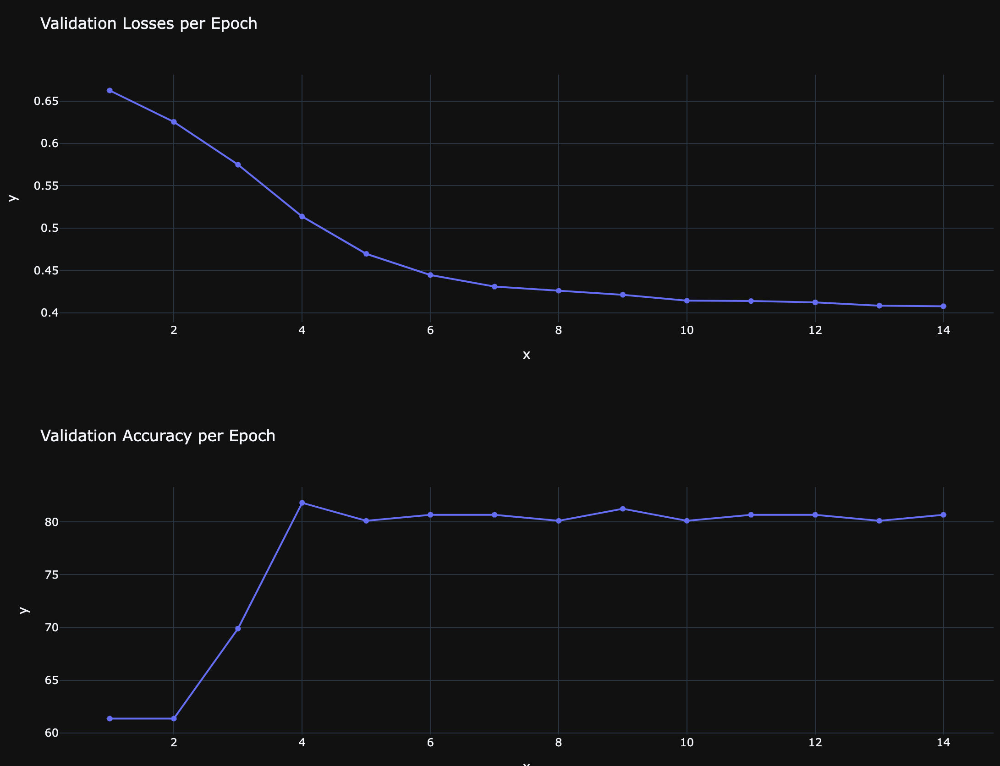

# Kaggle Titanic Dataset

This is the Kaggle competition to create a model to predict whether a passenger on the ship unseen in the training data will survive. After some data analysis, a feedforward neural network is used to train on the data, and achieves an accuracy of 77.5%. More details are given in `notebook.ipynb`.

